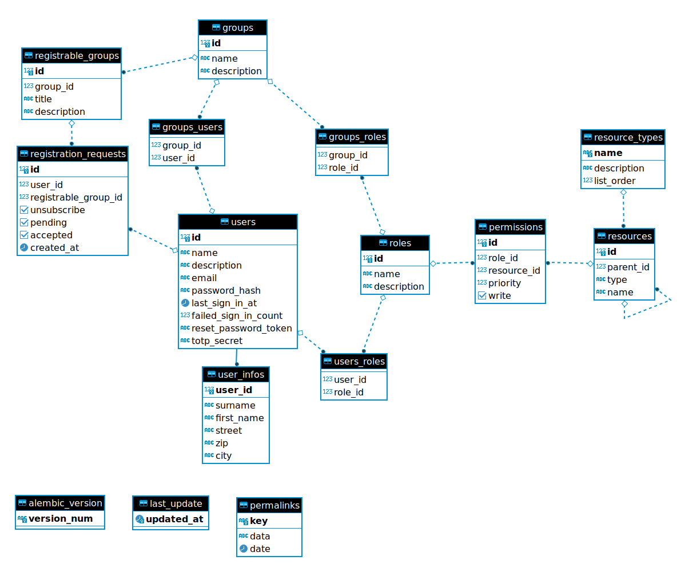

QWC Configuration Database
==========================

Setup database schema for configurations and permissions of QWC services using
[Alembic](http://alembic.zzzcomputing.com/en/latest/) database migrations.

Shared module for providing SQLAlchemy ORM models for ConfigDB queries.



Setup
-----

Uses PostgreSQL connection service `qwc_configdb` (ConfigDB) (cf. `sqlalchemy.url` and `version_table_schema` in `alembic.ini`).

Setup PostgreSQL connection service file `pg_service.conf`:

```
[qwc_configdb]
host=localhost
port=5439
dbname=qwc_demo
user=qwc_admin
password=qwc_admin
sslmode=disable
```

Place this file in your home directory, or set the `PGSERVICEFILE` environment variable to point to the file.

Create user according to service `qwc_configdb`:

    CREATE ROLE qwc_admin LOGIN PASSWORD 'qwc_admin';

Create schema for migration table and ConfigDB in `qwc_configdb`:

    CREATE SCHEMA qwc_config AUTHORIZATION qwc_admin;


Usage
-----

Run commands from this directory.

Create a migration script:

    alembic revision -m "create sample table"

Edit generated migration script `alembic/versions/123456abcdef_create_sample_table.py`

Run migrations:

    alembic upgrade head

Upgrade one version:

    alembic upgrade +1

Downgrade one version:

    alembic downgrade -1


Development
-----------

Install Python module for PostgreSQL:

    apt-get install python3-psycopg2

Create a virtual environment:

    virtualenv --python=/usr/bin/python3 --system-site-packages .venv

Without system packages:

    virtualenv --python=/usr/bin/python3 .venv

Activate virtual environment:

    source .venv/bin/activate

Install requirements:

    pip install -r requirements.txt
